<div align="center">

# PA4 Submission: TaskFlow Pipeline


</div>

<div style="background:#f5f3ff;color:#111827;border-left:6px solid #6330bc;padding:14px 18px;border-radius:10px;margin:18px 0;">
Copy this file to <code style="color:#111827;background:#ddd6fe;padding:2px 4px;border-radius:4px;">SUBMISSION.md</code>. Put every screenshot in <code style="color:#111827;background:#ddd6fe;padding:2px 4px;border-radius:4px;">docs/</code>, embed it under the correct task, and write a short description below each image explaining what it proves. The grader should not need any file outside this repository.
</div>

## Student Information

| Field | Value |
|---|---|
| Name | Muhammad Faraz Ahmad |
| Roll Number | 26100250 |
| GitHub Repository URL | https://github.com/farazahmad2004/CS487-PA4 |
| Resource Group | `rg-sp26-26100250` |
| Assigned Region | `swedencentral` (assigned was `uaenorth`; used `swedencentral` due to quota issues) |

## Evidence Rules

- Use relative image paths, for example: ``.
- Every image must have a 1-3 sentence description below it.
- Azure Portal screenshots must show the resource name and enough page context to identify the service.
- CLI screenshots must show the command and output.
- Mask secrets such as function keys, ACR passwords, and storage connection strings.


## Task 1: App Service Web App (15 points)

### Evidence 1.1: Forked Repository

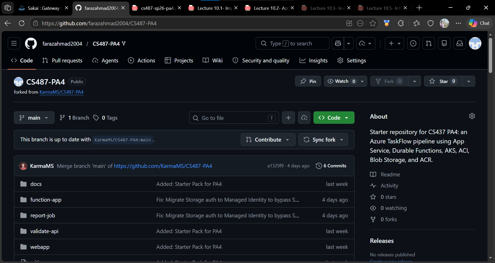

Description: The above figure shows the forked repo under https://github.com/farazahmad2004/CS487-PA4 with the directory structure visible. 

### Evidence 1.2: App Service Overview

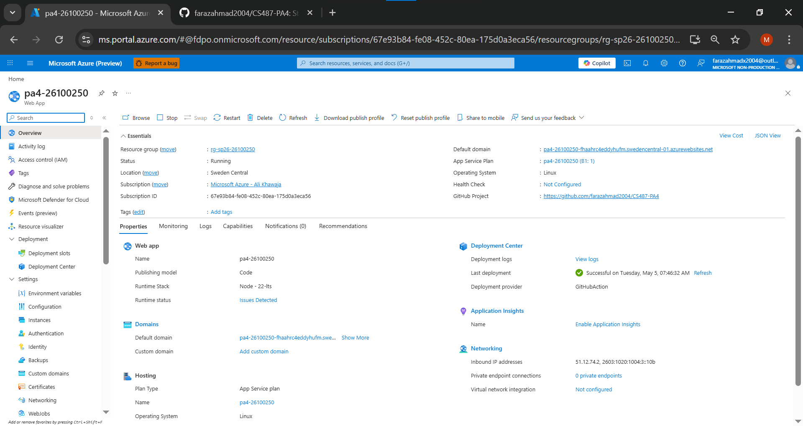

Description: The above figure shows that the web app `pa4-26100250` is running in the app service plan `pa4-26100250` in `rg-sp26-26100250`. Node 22 LTS was used as Node 20 LTS wasn't available. I also had to choose Sweden Central as my region because both UAE North and UK South showed quota issues. The public URL for the web app is:
[pa4-26100250-fhaahrc4eddyhufm.swedencentral-01.azurewebsites.net](https://pa4-26100250-fhaahrc4eddyhufm.swedencentral-01.azurewebsites.net/)


### Evidence 1.3: Deployment Center / GitHub Actions

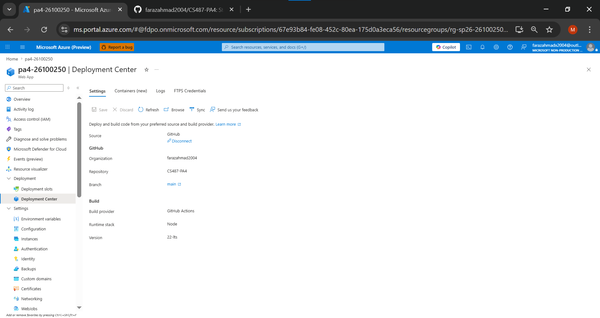

Description: The above figure shows that the web app is now connected to GitHub (via the deployment center) for CI/CD. There were some issues initially with this setup: The automatically generated yml file assumed the project directory to be root (`.`) instead of `webapp/`, which resulted in GitHub actions failure. This was solved by setting the working directory and path to be `webapp/`.

### Evidence 1.4: Live Web UI
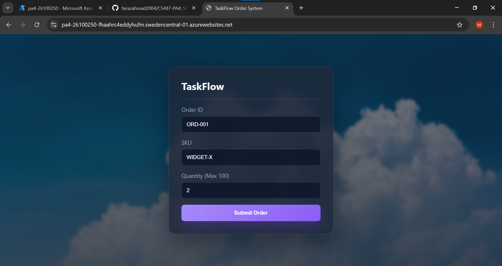


Description: The above figure shows that the web app is accessible in a browser from its public URL. Obviously, clicking submit order wouldn't work as we haven't finished the required setup for the app to run.

### Evidence 1.5: Application Settings configured
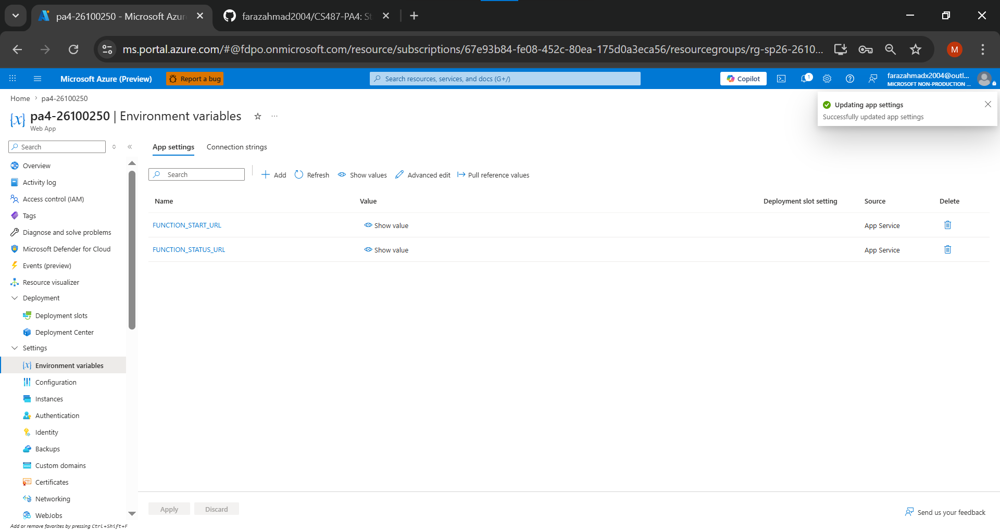
Description: The above figure shows that the application settings (the environment variables `FUNCTION_START_URL` and `FUNCTION_STATUS_URL`) have been added successfully. I used `pending` value for both of them, which gets filled with the correct URLs later.

---

## Task 2: Azure Container Registry (15 points)

### Evidence 2.1: ACR Overview
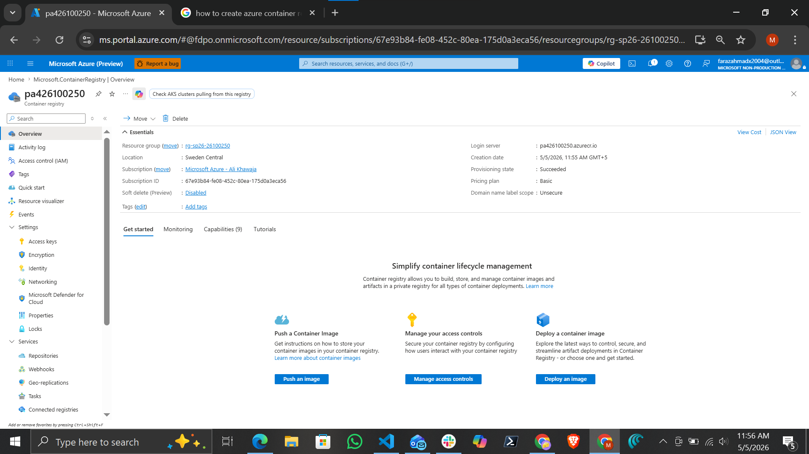

Description: The above screenshot shows that ACR (`pa426100250`) creation was successful (with Basic SKU in region Sweden Central).

### Evidence 2.2: Docker Builds
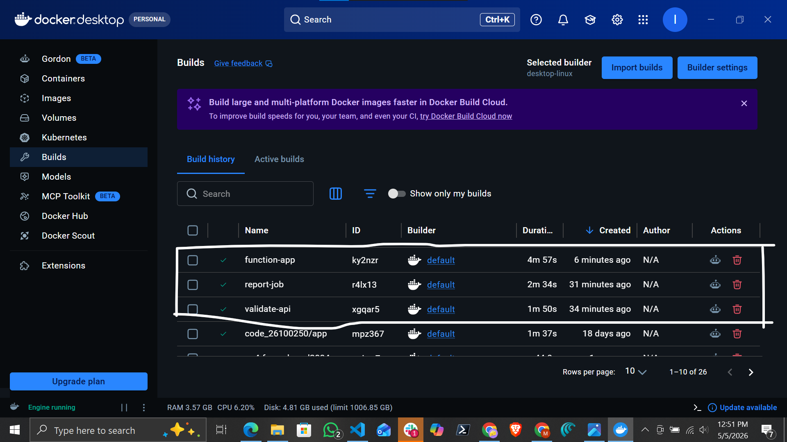

Description: The above screenshot shows the Docker Builds page confirming that the builds for `validate-api` (validate-api/), `report-job` (report-job/), and `func-app` (function-app/) were successful.

### Evidence 2.3: Local Test of the Validator:
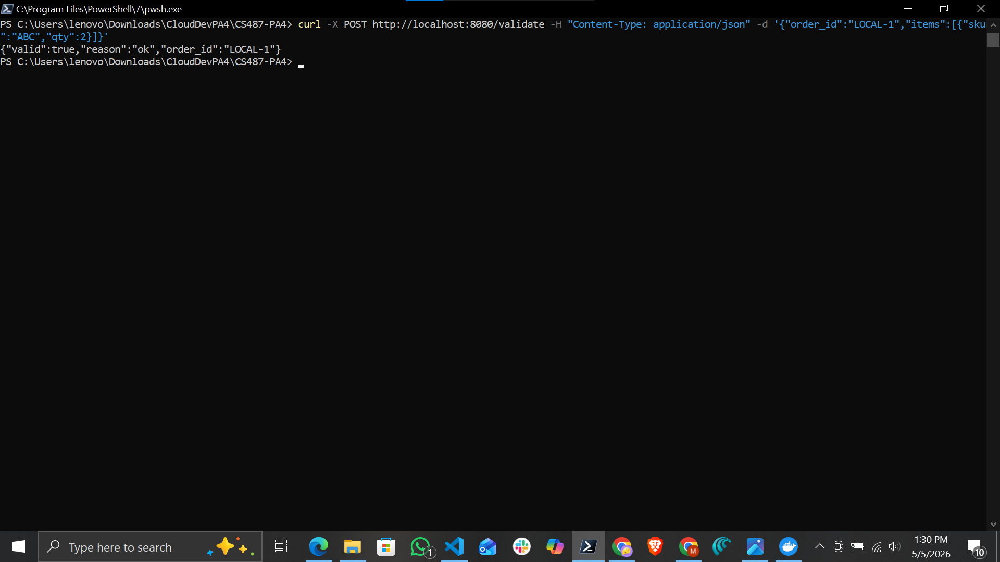
Description: This screenshot shows the successful local test of the validator, that returns with `valid=true` and `reason=ok`. 
### Evidence 2.4: ACR Repositories
Below are three screenshots one-by-one that show the successful pushes to ACR for all three images (more screenshots because CLI output was huge)
#### Screenshots:
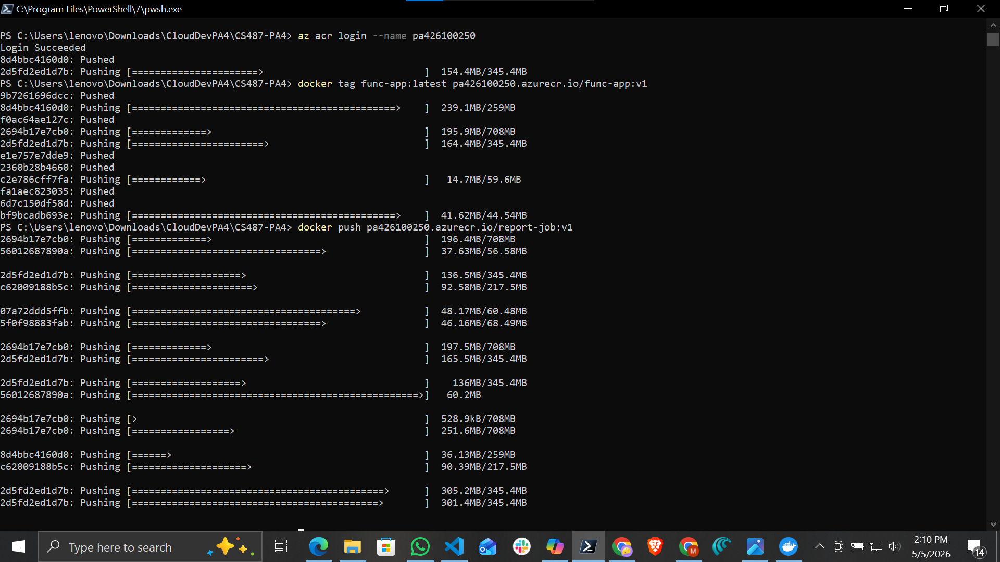
Description: Pushing images to acr.
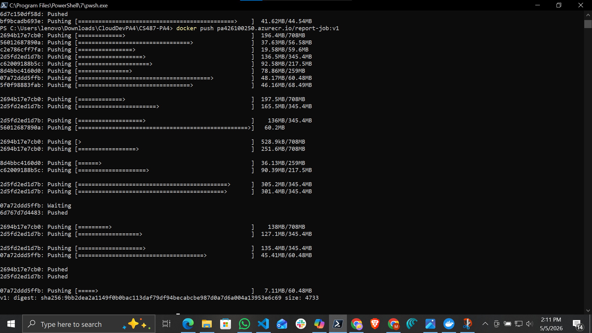
Description: Here, the pushes may look like ongoing, but they were completed and this weird output is because the terminal output and commands got mixed up (common in powershell). The successful pushes can be confirmed by the next screenshot.
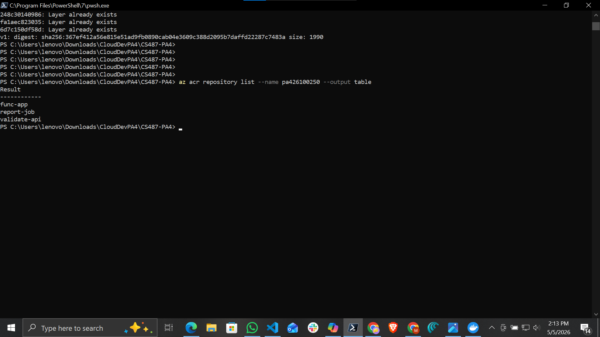
Description: ACR repository list showing `validate-api`, `report-job`,and `func-app`.

---

## Task 3: Durable Function Implementation (12 points)

### Evidence 3.1: Completed Function Code

Function Link: [function_app.py](function-app/function_app.py).


### Evidence 3.2: Local Function Handler Listing
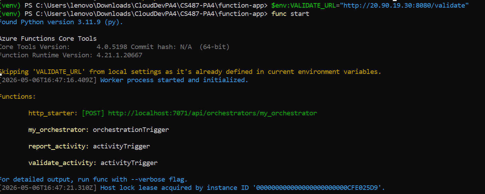
Description: This screenshot shows that `func start` successfully registers all handlers: HTTP starter, orchestrator, validate_activity, report_activity.
### Evidence 3.3: Local Smoke Test of validate_activity against the deployed AKS service
#### Screenshots:
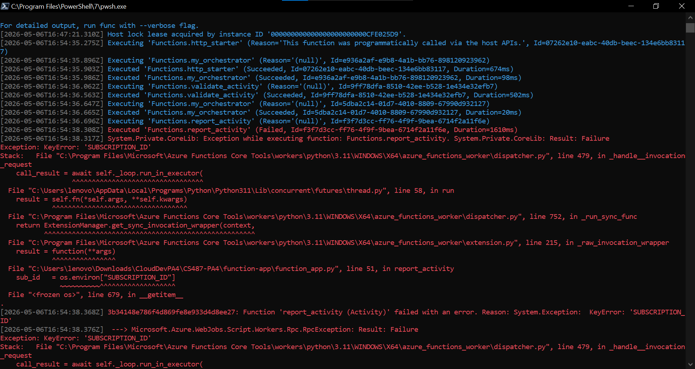
Description: After completing task 5, we can see that the orchestrator starts perfectly, then `validate_activity` executes successfully against AKS cluster and then throws a huge error because cloud credentials aren't loaded on the laptop.
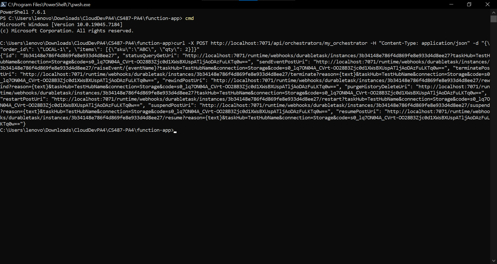
Description: This screenshot shows the output of the curl command returning the id and many other URLs.

---

## Task 4: Function App Container Deployment (8 points)

### Evidence 4.1: Function App Container Configuration
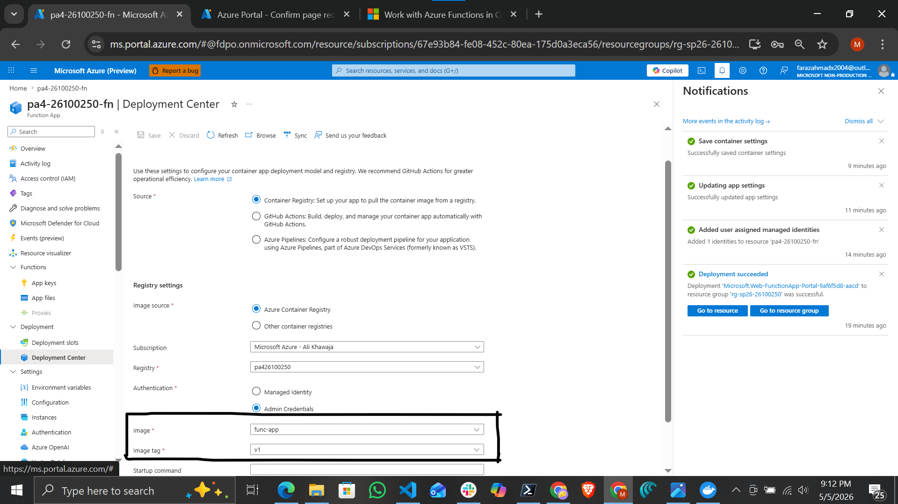

Description: This screenshot confirms that the container image used for the function app is `func-app:v1`.

### Evidence 4.2: Functions list in the Portal
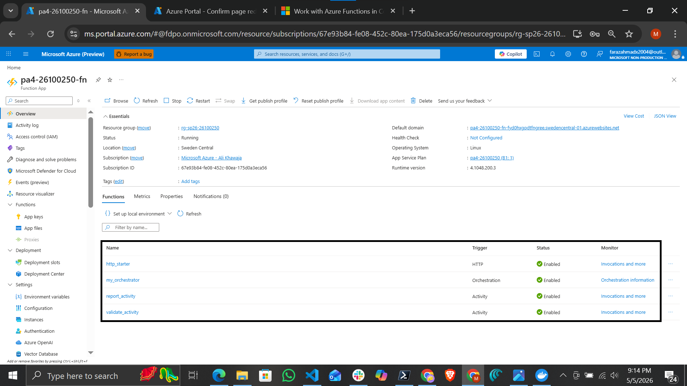
Description: This screenshot confirms that `http_starter`, `my_orchestrator`,
`validate_activity`, `report_activity` are all present in the functions list in the portal.
### Evidence 4.3: Orchestration Smoke Test
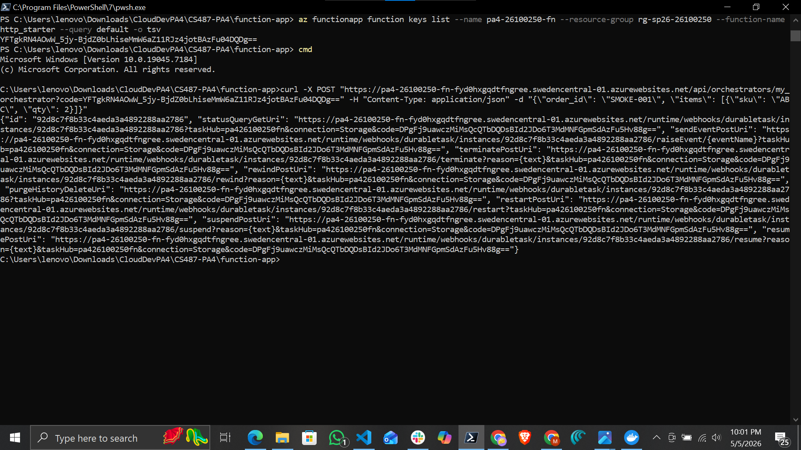
Description: This screenshot shows the output of the `curl` command, which started an orchestration and then returned a json object with `id` and `statusQueryGetUri` along with other URLs.
TODO: Embed screenshot of the `curl` output that starts an orchestration and returns status URLs. This shows the orchestration successfully started.

### Evidence 4.4: Expected Failed Status Before Downstream Wiring
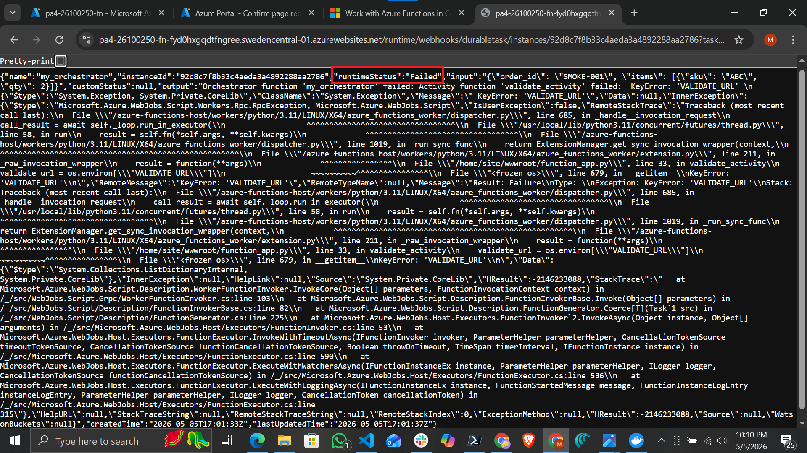

Description: This screenshot shows that the orchestration started and then failed (`runtimeStatus=Failed`). This is expected because `VALIDATE_URL` is not yet configured. This confirms that all other deployment works perfectly, only the validation doesn't work because the validate url isn't yet setup.

---

## Task 5: AKS Validator (15 points)

Since I used Poweshell, I had to use slightly different versions of the commands given in the manual. The commands used were:
```bash
# aks creation command:
az aks create --resource-group rg-sp26-26100250 --name pa4-26100250 --node-count 1 --node-vm-size Standard_B2s --generate-ssh-keys
# getting credentials:
az aks get-credentials --resource-group rg-sp26-26100250 --name pa4-26100250
# verification:
kubectl get nodes
```

### Evidence 5.1: AKS Cluster

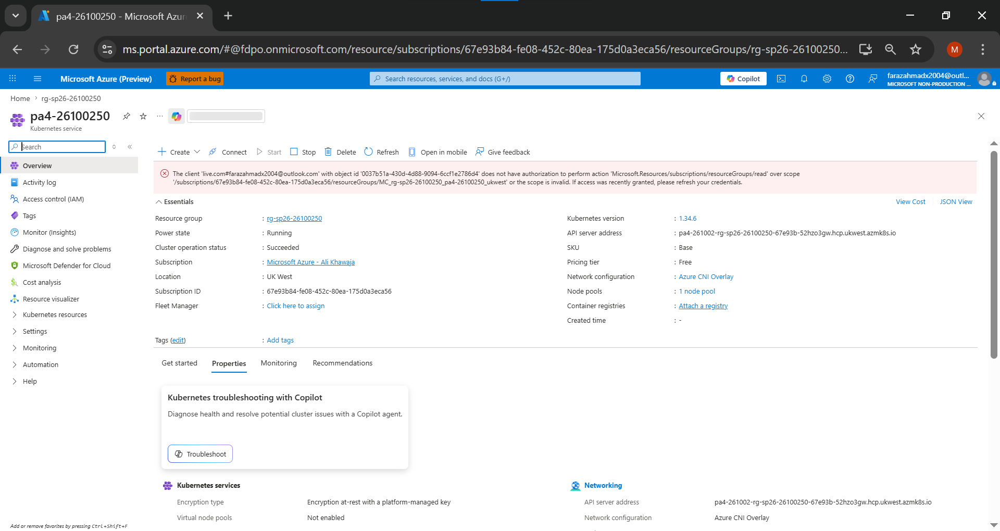

Description: The above figure shows the overview page of the AKS `pa4-26100250` with Succeeded status. It has one node and the node size is Standard_B2s. It was created in `rg-sp26-26100250` and in UK West because the resource group is there.

### Evidence 5.2: Kubernetes Nodes and Pods
#### Get Nodes:

Description: The above screenshot shows that the `kubectl get nodes` successfully shows the cluster node with status Ready.
TODO: Embed screenshot of `kubectl get nodes` and `kubectl get pods`.
#### Terminal Commands:
```bash
$ACR_USER = az acr credential show -n pa426100250 --query username -o tsv
$ACR_PASS = az acr credential show -n pa426100250 --query "passwords[0].value" -o tsv
kubectl create secret docker-registry acr-secret --docker-server=pa426100250.azurecr.io --docker-username=$ACR_USER --docker-password=$ACR_PASS
# applying kubernetes config:
kubectl apply -f validate-api/k8s/deployment.yaml
kubectl apply -f validate-api/k8s/service.yaml
# watch
kubectl get pods
```
#### Get Pods:

Description: The above screenshot shows the output of `kubectl get pods`, which confirms that the validator pod is now Running.

### Evidence 5.3: Kubernetes Service
#### Command:
```bash
kubectl get service validate-service
```


Description: The above screenshot shows the output of `kubectl get service validate-service`, which shows that the assigned CLUSTER-IP is `10.0.23.234`, EXTERNAL-IP is `20.90.19.30` and port(s) are `8080:30743`.

### Evidence 5.4: Validator API Tests
#### Commands:
```bash
curl http://20.90.19.30:8080/health
curl -X POST http://20.90.19.30:8080/validate -H "Content-Type: application/json" -d "{\"order_id\": \"0-1001\", \"items\": [{\"sku\": \"ABC\", \"qty\":2}]}"
curl -X POST http://20.90.19.30:8080/validate -H "Content-Type: application/json" -d "{\"order_id\": \"0-1002\", \"items\": [{\"sku\": \"ABC\", \"qty\":999}]}"
```
#### Screenshot:

Description: The above screenshot shows the outputs of `curl /health` and valid and invalid `/validate` curl requests. We can see that every command gives expected results: The valid curl successfully returns "ok", while the invalid one gives "quantity exceeds limit" because the given quantity there (999) was greater than 100.

### Evidence 5.5: Function App `VALIDATE_URL`
#### Command:
```bash
az functionapp config appsettings set --name pa4-26100250-fn --resource-group rg-sp26-26100250 --settings VALIDATE_URL="http://20.90.19.30:8080/validate"
```
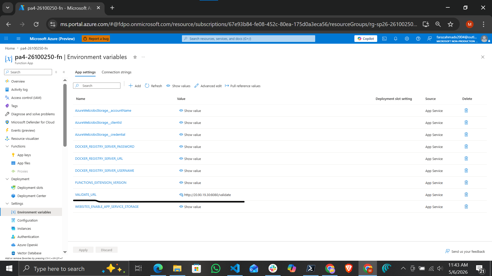
The above screenshot shows that `VALIDATE_URL` is correctly configured in Environment Variables of the function app.

### Evidence 5.6: AKS Idle Behavior
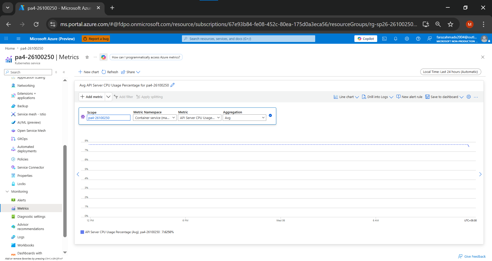
Description: As we can see from the Avg. CPU consumption metric chart, the CPU consumption is still around 7-8% even though the service is now idle. This is because it's a long running service (an industry standard), compared to ACI (which is short-lived).

---

## Task 6: ACI Report Job (15 points)

### Evidence 6.1: Blob Container
The CLI command for creation of the container failed saying "request is blocked by the network rules of storage account". So, I used portal to create the blob container.


Description: The above screenshot shows the `reports` container present in the storage account `pa426100250`. This container will store the generated PDFs.

### Evidence 6.2: Manual ACI Run
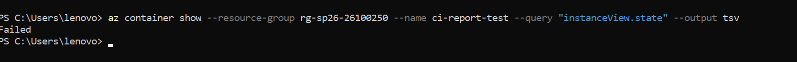

Description: This shows the output of `az container show`, and it failed. The reason for this is cleared in the next screenshot which is AuthorizationError (clear in the logs). Due to some misconfiguration either in Managed Identity or somewhere else, the authentication never works.

### Evidence 6.3: ACI Logs
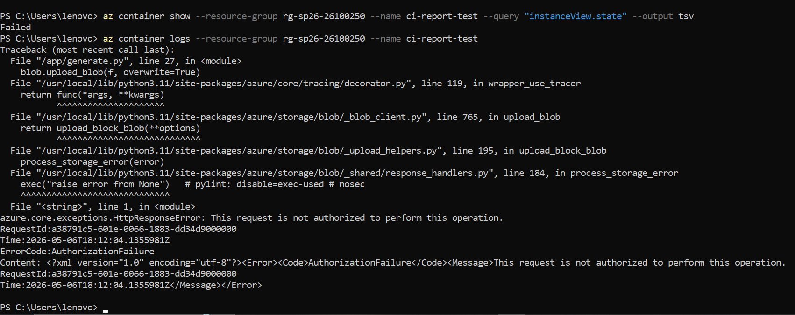
Description: The logs clearly explain the scenario. This was debugged for more than 7 hours with no solution found until midnight.
### Evidence 6.4: Generated PDF
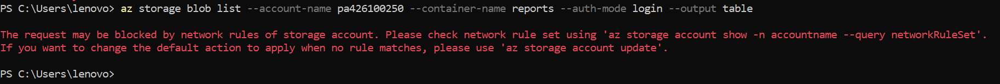
Description: This shows that network rules of storage account stop the execution of this command, which was the same reponse in 6.1 (which then was done using portal). ANyways, it wouldn't work as PDF is not stored becuase of previous Authorization error.
### Evidence 6.5: Function App Managed Identity and IAM
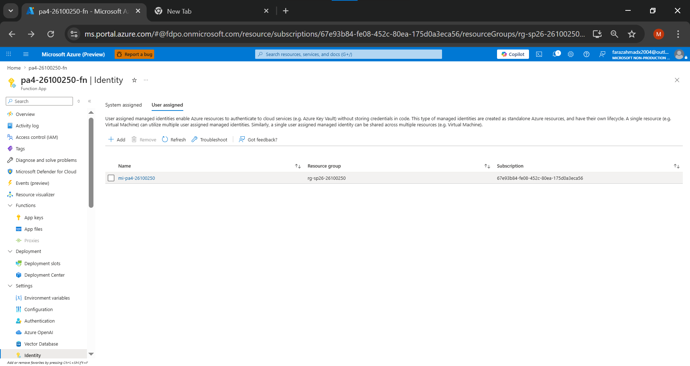
This one shows that the managed identity was successfully added to Identity of the function. (This was 100% successful).

### Evidence 6.6: Report App Settings
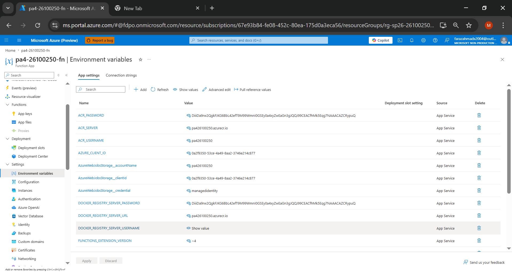
Description: All environment variables were successfully added to the function app.

---

## Task 7: End-to-End Pipeline (15 points)

### Evidence 7.1: Web App Wiring
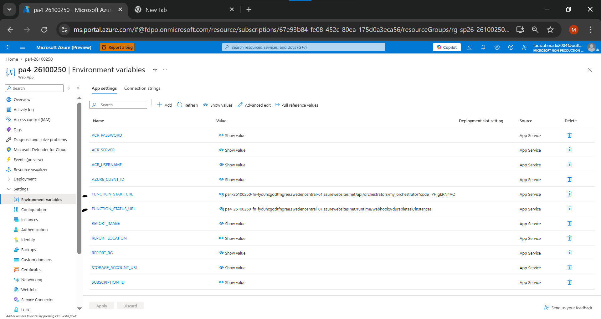
Description: This screenshot shows that `FUNCTION_START_URL` and `FUNCTION_STATUS_URL` are correctly configured on the Web App.

### Evidence 7.2: Happy Path UI

TODO: Embed screenshots of the form before submit, Running status, and Completed status with report URL.

Description: TODO: Explain the valid order payload and final result.

### Evidence 7.3: Backend Participation

TODO: Embed screenshots showing Function App invocation, AKS validator evidence, ACI evidence, and Blob PDF evidence.

Description: TODO: Trace the same order ID across services.

### Evidence 7.4: Reject Path UI

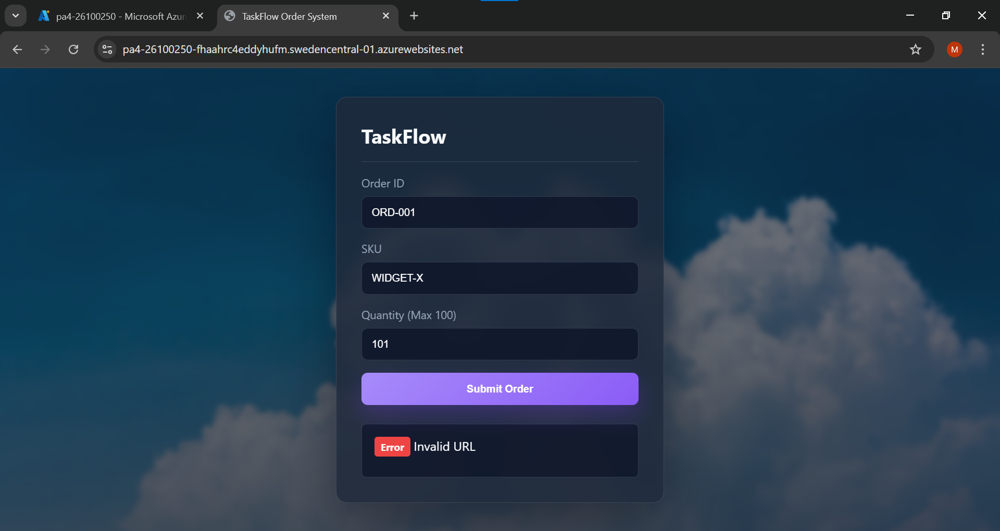
This screenshot shows that there is rejection for order > 100.

---

## Task 8: Write-up and Architecture Diagram (5 points)

### Evidence 8.1: Architecture Diagram

TODO: Embed your architecture diagram from `docs/`.

Description: TODO: Confirm that it shows GitHub, App Service, Durable Function, AKS, ACI, Blob Storage, ACR, and IAM.

### Question 8.2: Service Selection

TODO: In 3-4 sentences each, explain why TaskFlow uses App Service, Durable Functions, AKS, and ACI for their specific roles.

### Question 8.3: ACI vs AKS

TODO: Compare idle behavior, cost behavior, and operational model for AKS and ACI using your screenshots.

### Question 8.4: Durable Functions vs Plain HTTP

TODO: Explain at least two problems that Durable Functions solves for this sequential workflow.

### Question 8.5: Cost Review

TODO: Embed Cost Management screenshot scoped to your resource group.

Description: TODO: Identify the most expensive resource and explain why.

### Question 8.6: Challenges Faced

TODO: Describe at least two real issues you hit and how you debugged them.

---
